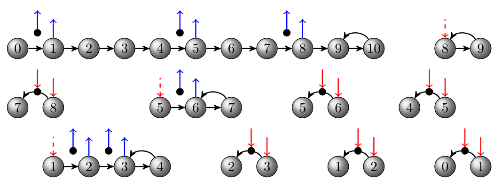

# PNODE and SINODE: A PETSc-based Neural ODE Implementation

This repository provides a neural ordinary differential equation (ODE) implementation using PyTorch and [PETSc](https://petsc.org/release/overview/)'s discrete adjoint ODE solvers (TSAdjoint). The framework allows easy access to PETSc's time stepping algorithms, adjoint solvers and checkpointing algorithms. Switching between different algorithms can be simply done with command line options at runtime. All the examples are fully supported to run on the GPU with single or double precision. For the algorithm details, see the papers [A Memory-Efficient Neural Ordinary Differential Equation Framework Based on High-Level Adjoint Differentiation](https://arxiv.org/pdf/2206.01298) (**IEEE TAI**) and [Semi-Implicit Neural Ordinary Differential Equations](https://arxiv.org/abs/2412.11301) (**AAAI 2025**).

---

## :rocket: News
 - v1.1 has been released on Dec 17, 2024
 - This release features a SINODE implementation and examples (see [`examples-sinode`](./examples-sinode))

<!-- <p align="center">
  
  
</p> -->

## :computer: Installation
petsc4py needs to be installed first. The suggested way to install petsc4py is to install it from PETSc source
```
git clone https://gitlab.com/petsc/petsc.git
cd petsc
./configure PETSC_ARCH=arch-linux-opt --with-debugging=0 --with-petsc4py
```
Here minimal configure options are provided. Several other widely used options are listed below:

 - `--with-cuda=1` Use CUDA if an NVIDIA GPU is available.
 - `--with-fc=0` Disable Fortran if you do not have a Fortran compiler or do not need Fortran.
 - `--with-precision=single` Build PETSc with single precision (without his option, PETSc uses double precision).
Note that `PETSC_ARCH` takes of your choice. One can create many different versions of PETSc, each of which can have a different list of options and be given a different name specified by `PETSC_ARCH`.

After configure, follow the instructions on screen to do make all and make check (optional).

After petsc4py is installed, install PNODE
```
git clone https://github.com/caidao22/pnode.git
cd pnode
pip3 install .
```

## :books: Examples
PNODE examples are provided in the [`examples-pnode`](./examples-pnode) directory.

 - [`examples-pnode/ode_demo_petsc.py`](./examples-pnode/ode_demo_petsc.py) Simplest example that demonstrate how to fit a spiral ODE
 - [`examples-pnode/train-Cifar10.py`](./examples-pnode/train-Cifar10.py) Image classification on the CIFAR-10 dataset
 - [`ffjord-pnode/train_tabular.py`](./ffjord-pnode/train_tabular.py) Continuous normalizing flow on the datasets from MAF

SINODE examples are provided in the [`examples-sinode`](./examples-sinode) directory. The datasets (compressed in tar.gz file) associated with these examples can be downloaded [here](https://web.cels.anl.gov/projects/petsc/sinode-data/sinode-data.tar.gz) and must be placed in the corresponding subfolders before running the code.

 - [`examples-sinode/Burgers`](./examples-sinode/Burgers) Learning dynamics for the viscous Burgers equation
 - [`examples-sinode/KS`](./examples-sinode/KS) Learning dynamics for the Kuramoto–Sivashinsky (KS) equation
 - [`examples-sinode/grand`](./examples-sinode/grand) Graph Classification with [GRAND](https://arxiv.org/abs/1911.07532)


## :beginner: Basic usage
This library provides one class `ODEPetsc` with three interface functions:

 - `setupTS` setup function for the solver
 - `odeint_adjoint` the main interface function that solves a neural ODE and calculates the gradient with discrete adjoint methods
 - `odeint` general-purpose ODE/DAE solver (without gradient calculation)

The API is similar to `NODE` and `ANODE` by design.

To solve an ODE in the form
```
du/dt = f(t, u)    u(t_0) = u_0,
```
One needs to create an ODEPetsc object
```
from pnode import petsc_adjoint
ode = petsc_adjoint.ODEPetsc()
```
and then set up the solver with
```
ode.setupTS(u0, func, step_size=step_size, implicit_form=implicit_form, use_dlpack=use_dlpack)
```
where `func` is any callable implementing the ordinary differential equation `f(t, u)`, `u0` is an _any_-D Tensor or a tuple of _any_-D Tensors representing the initial values.

```
ode.odeint_adjoint(u0, t)
```
where `t` is a 1-D Tensor containing the evaluation points and  `t[0]` is the initial time.

`odeint_adjoint` performs a forward sweep using the PETSc TS solver and a backward sweep using the PETSc TSAdjoint solver.

### Keyword Arguments in the setup function
 - `step_size` Step size for time integration.
 - `method` One of the solvers among 'euler', 'midpoint', 'rk4', 'dopri5'.
 - `enable_adjoint` Switch for enabling or disabling the adjoint sweep.

These are just a few options for convenience. More PETSc settings can be used at runtime with command line options. For example, `-ts_type cn` will choose the Crank-Nicolson methods for time integration, and `-ts_type rk -ts_rk_type 4` will choose the classic RK4 solver. For more details, we suggest reading the PETSc manual and the examples included.

## :floppy_disk: Checkpointing
PNODE offers a variety of optimal checkpointing strategies through the PETSc TSAdjoint library. For best efficiency, we suggest users to start from the following options
```
-ts_trajectory_type memory -ts_trajectory_solution_only 0
```
This will make PNODE store the solutions and stage values in DRAM at each time step in the forward sweep. If there is a limited memory budget, one can specify the maximum number of allowable checkpoints by adding an extra option `-ts_trajectory_max_cps_ram <num_of_checkpoints>`.

<p align="center">

</p>

---
If you found this tool useful in your research, please consider citing.

```
@article{Zhang2024sinode},
  author={Zhang, Hong and Liu, Ying and Maulik, Romit},
  journal={Proceedings of the AAAI Conference on Artificial Intelligence},
  title={Semi-Implicit Neural Ordinary Differential Equations},
  year={2024},
  volum={},
  number={},
  pages={},
  doi={}
}

@article{Zhang2022pnode,
  author={Zhang, Hong and Zhao, Wenjun},
  journal={IEEE Transactions on Artificial Intelligence}, 
  title={A Memory-Efficient Neural Ordinary Differential Equation Framework Based on High-Level Adjoint Differentiation}, 
  year={2022},
  volume={},
  number={},
  pages={1-11},
  doi={10.1109/TAI.2022.3230632}}
}

@article{Zhang2022tsadjoint,
  author = {Zhang, Hong and Constantinescu, Emil M. and Smith, Barry F.},
  title = {{PETSc TSAdjoint: A Discrete Adjoint ODE Solver for First-Order and Second-Order Sensitivity Analysis}},
  journal = {SIAM Journal on Scientific Computing},
  volume = {44},
  number = {1},
  pages = {C1-C24},
  year = {2022},
  doi = {10.1137/21M140078X},
  eprint = {https://doi.org/10.1137/21M140078X},
}

@article{Zhang2023cams,
  author = {Zhang, Hong and Constantinescu, Emil M},
  title = {Optimal checkpointing for adjoint multistage time-stepping schemes},
  journal = {Journal of Computational Science},
  volume = {66},
  pages = {101913},
  year = {2023},
  issn = {1877-7503},
  doi = {https://doi.org/10.1016/j.jocs.2022.101913},
  url = {https://www.sciencedirect.com/science/article/pii/S1877750322002721},
}
```
